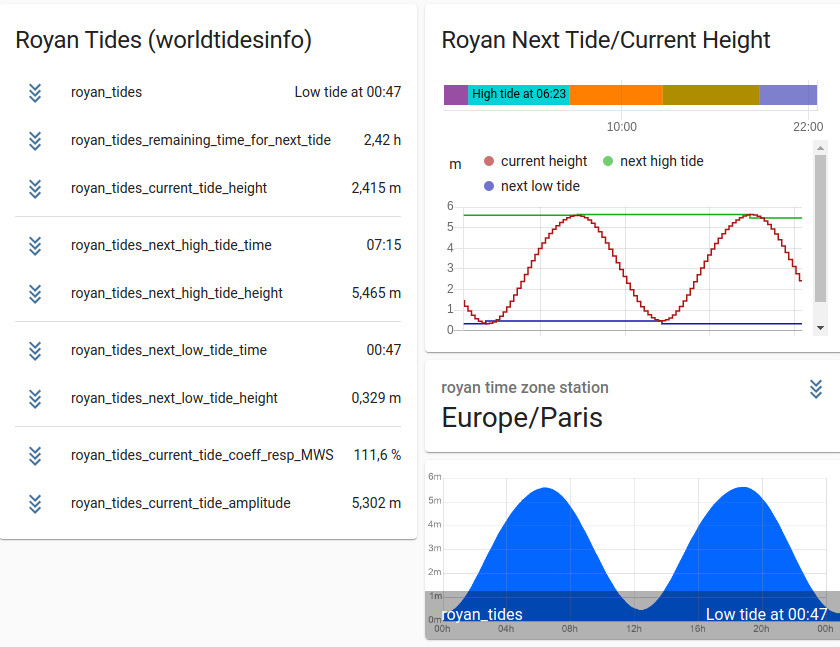

# worldtidesinfocustom
world tides info custom component for [Home Assistant](https://home-assistant.io/).


[](https://github.com/custom-components/hacs)


This component is used to retrieve tide information for a dedicate location (all over the world) : [https://www.worldtides.info/](https://www.worldtides.info/)

This component allows to :
- display the tide curve (height)
- gives the current height
- gives the next tide

Refresh rate (Scan Interval) is every 15minutes with refresh of data from server every 12h

The service has to be paid. So the component :
- trigger, few times a day , a request to server : save bandwith and save credit

E.g. implementation request twice a day : 2*3=6 credits. 20000 credits will last ~9 years

From behaviour point of view it's an enhancement of the 
[integration worldtidesinfo](https://www.home-assistant.io/integrations/worldtidesinfo/) 


## Installation
### [HACS](https://hacs.xyz/) (Home Assistant Community Store)  { Pull request undergoing }
1. Go to HACS page on your Home Assistant instance 
1. Select `integration` 
1. Press add icon and search for `worldtidesinfocustom` 
1. Select worldtidesinfocustom repo and install 
1. Force refresh the Home Assistant page (<kbd>Ctrl</kbd> + <kbd>F5</kbd>) 
1. Add worldtidesinfocustom to your page
### Manual
1. Download the folder worldtidesinfocustom from the latest [release](https://github.com/jugla/worldtidesinfocustom/releases) (with right click, save 
link as) 
1. Place the downloaded directory on your Home Assistant machine in the `config/custom_components` folder (when there is no `custom_components` folder in the 
folder where your `configuration.yaml` file is, create it and place the directory there) 
1. restart HomeAssistant
## Using the component
Get API key from https://www.worldtides.info/developer (buy prepaid)
In configuration.yaml, declare :
```yaml
sensor:
  - platform: worldtidesinfocustom
    name: royan_tides
    api_key: YOUR_API_KEY
    latitude: 45.61949378902948
    longitude: -1.0318721687376207
#    station_distance: 10
#    vertical_ref : LAT
#    scan_interval: 900
#    worldtides_request_interval: 43200

``` 
where :
- name is name of your sensor
- api_key is the key you get from [world tides info](https://www.worldtides.info/developer) 
- latitude, longiude is the place you want to see (hereabove Royan,France)

and  optional parameter
- station_distance: the radius in km from location to retrieve tide station
- vertical_ref : the reference you want to use for tide (default is LAT). See [datum ref](https://www.worldtides.info/datums)
- scan_interval : the scan rate to refresh entity (should not be used)
- worldtides_request_interval : the scan rate to fetch data on server (should not be used)

One entity is declared with attibutes. To see them as sensor, please follow the example
```yaml
sensor:
  - platform: template
    sensors:
      tide_royan_next_high:
        value_template: '{{ as_timestamp(states.sensor.royan_tides.attributes.high_tide_time_utc) | timestamp_custom("%a %d/%m/%Y %H:%M") }}'
        friendly_name: "Royan Next High Tide"
      tide_royan_next_low:
        value_template: '{{ as_timestamp(states.sensor.royan_tides.attributes.low_tide_time_utc) | timestamp_custom("%a %d/%m/%Y %H:%M") }}'
        friendly_name: "Royan Next Low Tide"
      tide_royan_next_high_height:
        value_template: "{{ state_attr('sensor.royan_tides','high_tide_height')  }}"
        friendly_name: "Royan Next High Tide Height"
        unit_of_measurement: m
      tide_royan_next_low_height:
        value_template: "{{ state_attr('sensor.royan_tides','low_tide_height')  }}"
        friendly_name: "Royan Next Low Tide Height"
        unit_of_measurement: m
      tide_royan_credit:
        value_template: "{{ state_attr('sensor.royan_tides','CreditCallUsed')  }}"
        friendly_name: "Royan Tide Credit"
        unit_of_measurement: credit
      tide_royan_current_height:
        value_template: "{{ state_attr('sensor.royan_tides','current_height')  }}"
        friendly_name: "Royan Tide Current Height"
        unit_of_measurement: m

## CAMERA
camera:
  - platform: generic
    name: Royan_tides_curve
    still_image_url: https://127.0.0.1:8123/local/royan_tides.png
    verify_ssl: false

```

Hereafter an example under lovelace UI


<p align="center">
  
</p>

## Detail Configuration parameter

| Name              | Type                                                           | Requirement  | Supported | Default value        | Config                             | Description                                                                                                   |
|-------------------|----------------------------------------------------------------|--------------|-----------|----------------------|------------------------------------|--------------------------------------------------------------------------------------------------------------|
| name              | string                                                         | **Optional** | v1.0.0    | worldtidesinfocustom | YAML                                                                                                                                                               | name for sensor entity                                               |
| api_key           | string                                                         | **Required** | v1.0.0    | n.a | YAML                                                       | API Key given by [world tide info](https://www.worldtides.info/).                                          | 
| latitude          | float                                                          | **Optional** | v1.0.0    | latitude in your Home Assistant configuration | YAML                                                                                                                                                                  | Latitude (in decimal degrees) of the location for which to return the tidal data . |
| longitude         | float                                                          | **Optional** | v1.0.0    | latitude in your Home Assistant configuration | YAML                                                                                                                                                                  | Latitude (in decimal degrees) of the location for which to return the tidal data .    |
| station_distance  | positive int                                                   | **Optional** | v2.0.0    | 10km | YAML                                                                                                                                                                  | The maximum distance (in kilometers) for which to return tidal data from a tidal station instead of from the global background data (i.e. prediction from satellite data)         |
| vertical_ref      | string                                                         | **Optional** | v1.0.0    | LAT | YAML                                                                                                                                                                  | string that represents the vertical reference you want to use for tide (NB: LAT = Lowest Astronomical Tide as reference). See [datum ref](https://www.worldtides.info/datums) |  
| scan_interval     | positive int                                                   | **Optional** | v1.0.0    | 900s | YAML                                                                                                                                                                  | It's the time (in seconds) between 2 refresh of sensor with its attributes         |
| worldtides _request_interval     | positive int                                                   | **Optional** | v1.0.0    | 43200s | YAML                                                      | It's the time between 2 request from WorldTimeInfo serveur (each request request credit) |

## about vertical reference
Different Vertical reference can be used for tide. Please go to this page that explain [https://www.sailingissues.com/navcourse7.html](https://www.sailingissues.com/navcourse7.html)

## Detail Sensor attribute description
The platform create 1 sensor (name given in configuration.yaml). 
| Name              | Supported | format | unit | Description                                                                                                   |
|-------------------|-----------|--------|------|---------------------------------------------------------------------------------------------------------|
| name given in configuration.yaml  (e.g. royan_tides)    |  v1.0.0 |  strings | **HA local time**  | gives the next tide low or high with HA local time     |

This sensor has a set of attributes describes hereafter

| Name                 | Supported | format     | unit | Description                                                                                                   |
|----------------------|-----------|------------|------|---------------------------------------------------------------------------------------------------------------|
| High tide time utc   |  v1.0.0   |  in ISO 8601 standard date and time format, e.g.: 2017-06-12T19:47+0000 | **UTC**  | Next High tide in UTC     |
| High tide height     |  v1.0.0   |  float     | m    | Next High tide height     |
| Low tide time utc    |  v1.0.0   |  in ISO 8601 standard date and time format, e.g.: 2017-06-12T19:47+0000 | **UTC**  | Next High tide in UTC     |
| Low tide height      |  v1.0.0   |  float     | m    | Next High tide heiht     |
| Vertical reference   |  v1.0.0   |  string    | NA   |  string that represents the vertical reference you want to use for tide (NB: LAT = Lowest Astronomical Tide as reference). See [datum ref](https://www.worldtides.info/datums)    |
| Tidal station used   | v2.0.0    |  string    | NA   | strings that gives the tidal station used for data   |
| Current height       | v1.0.0    |  float     | m    | current height (**HA local time**)     |
| Current height utc   | v1.0.0    |  in ISO 8601 standard date and time format, e.g.: 2017-06-12T19:47+0000) | **UTC**  | height sample used to compute current height     |
| CreditCallUsed       | v1.0.0    | int        | credit | number of credit used between 1 scan interval |
| Data request time    | v1.0.0    | string like "01:02:39 17/01/21" | **HA local time** | time of last request to world tide info server |
| Plot                 | v1.0.0    | string     | unix path | name of the file that contains the tide curve picture. NB: the curve is given in **local time of the tide location**. It can be a shift of 1 hour if data is not provided by tide station but satellite data |
| CreditCallUsedForInit | v2.0.0   | int        | credit | credit used to retrieve tide station at startup |
| Station around nb    | v2.0.0    | int        | N/A  | number of tide station within radius specified in configuration.yaml |
| Station distance     | v2.0.0    | int        | km   | the radius used to retrieve tide station around location |
| Station around name  | v2.0.0    | string     | location name | tide station list separate by ";" |
| Station around time zone | v2.0.0 | string    | time zone | Full timezone name (ex. America/Los_Angeles) |
| Coeff                | v2.0.0    | int        | NA   | coeff that represents the ((next Hight Tide - next Low Tide) / (MHWS - MLWS) * 100) See [datum ref](https://www.worldtides.info/datums) |

## Wish/Todo list
- implement UI instead of YAML
- implement asynchoneous instead of polling
- make this integration as default in home assistant

## Contact

## Thanks to

## Support
