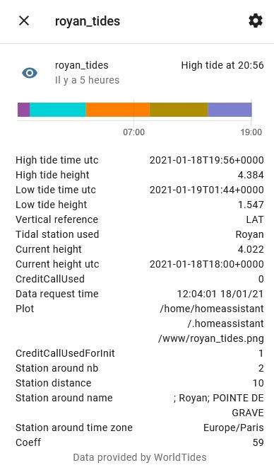
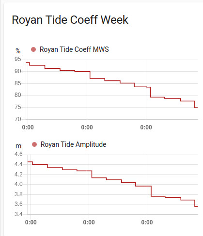
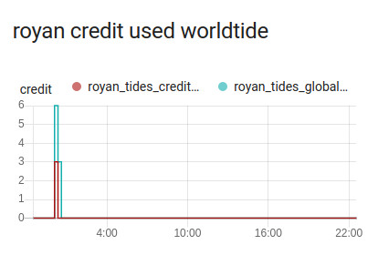
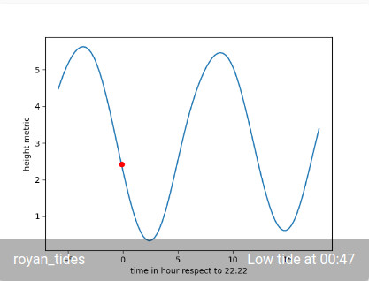
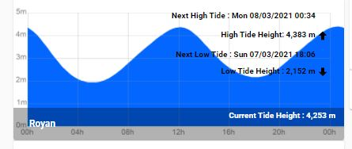
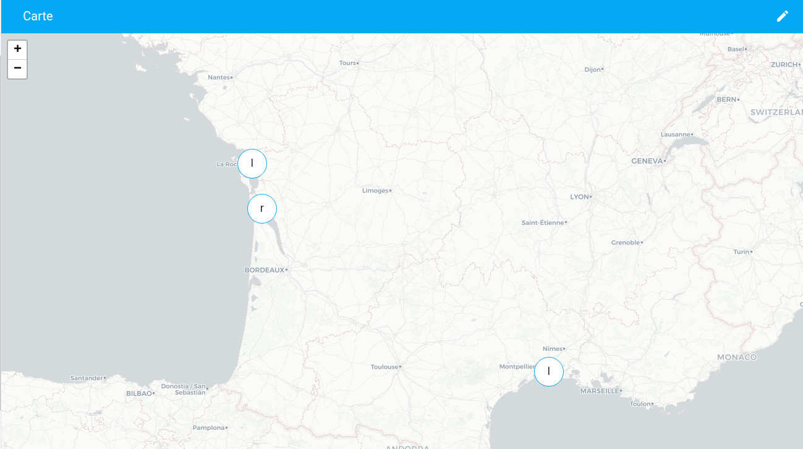

# worldtidesinfocustom
world tides info custom component for [Home Assistant](https://home-assistant.io/).


[](https://github.com/custom-components/hacs)


This component is used to retrieve tide information for a dedicated location (all over the world) : [https://www.worldtides.info/](https://www.worldtides.info/)

This component allows to :
- display the tide curve (height)
- give the current height
- give the next tide
- give tide tendancy, amplitude
- display location on default map

==> the monitored location is either static, either given by GPS data (tracker)

In static, refresh rate (Scan Interval) is every 15minutes with refresh of data from server once a day

The request per day per location uses 3 credits.
So for one location: 20000 credits will last ~18 years

Please refer to [https://www.worldtides.info/developer](https://www.worldtides.info/developer) for pricing (as few requests are done per month, prepaid seems to be the best deal). 

In motion, refresh rate (Scan Interval) is every 15minutes with refresh of data from server once a day, or if the position has moved more than a user parameter defined in UI

## Installation
Either use HACS (default), either manual
### [HACS](https://hacs.xyz/) (Home Assistant Community Store) 
1. Go to HACS page on your Home Assistant instance 
1. Select `integration` 
1. Press add icon and search for `worldtidesinfocustom` 
1. Select worldtidesinfocustom and install 

### Manual
<details><summary>Manual Procedure</summary>
  
1. Download the folder worldtidesinfocustom from the latest [release](https://github.com/jugla/worldtidesinfocustom/releases) (with right click, save 
link as) 
1. Place the downloaded directory on your Home Assistant machine in the `config/custom_components` folder (when there is no `custom_components` folder in the 
folder where your `configuration.yaml` file is, create it and place the directory there) 
1. restart HomeAssistant
</details>

## Breaking change
<details><summary>detail description</summary>

**Version V2.5.0**: Remove *CreditCallUsedForInit* attribute as init data are also refresh periodically (1 month)

**Version V2.6.1**: After this version, the information given is by default with unit system configured in HA (metric or imperial).
NB: Before *V2.6.0*, information were given only in metric. At *V2.6.0* the information given is by default in metric.

**Version V2.7.0**: After this version *Coeff* attribute is renamed in *Coeff_resp_MWS* . MWS stands for *mean water spring*.

**Version V3.0.0**: After this version *worldtides_request_interval* configuration optional parameter is removed.

</details>


## Using the component
- Get API key from https://www.worldtides.info/developer (buy prepaid)

- During configuration, you can define a Vertical Reference (default is LAT).
Please go to this page that explain [https://www.sailingissues.com/navcourse7.html](https://www.sailingissues.com/navcourse7.html)

- Either UI (prefered), either YAML (deprecated) :

   - **Use UI (Integration)** 

   - *Deprecated* in configuration.yaml, declare :

<details><summary>Example of YAML</summary>
  
```yaml
##configuration.yaml example
sensor:
  - platform: worldtidesinfocustom
    name: royan_tides
    api_key: YOUR_API_KEY
    latitude: 45.61949378902948
    longitude: -1.0318721687376207
#    unit: home_assistant
#    station_distance: 50
#    vertical_ref : LAT
#    plot_color: 2,102,255
#    plot_background: 255,255,255
#    scan_interval: 900

camera:
  - platform: worldtidesinfocustom
    name: royan_tides
``` 

where :
- name is name of your sensor
- api_key is the key you get from [world tides info](https://www.worldtides.info/developer) 
- latitude, longiude is the place you want to see (hereabove Royan,France)

and  optional parameter
- unit: the unit that you have chosen in *home_assistant* or *metric* or *imperial* (to display height in meter or feet, to specify station_distance in km or miles)
- station_distance: the radius in km/miles from location to retrieve tide station
- vertical_ref : the reference you want to use for tide (default is LAT). See [datum ref](https://www.worldtides.info/datums)
- plot_color : the comma-separated RGB values for the tide graph foreground color
- plot_background : the comma-separated RGB values for the tide graph background color
- scan_interval : the scan rate to refresh entity (should not be used)

</details>

- Several sensors and one camera are provided with attibutes. 
To see some attributes as sensor, you have to use template inside `configuration.yaml`. 
<details><summary>Please follow the hereafter example</summary>

```yaml
##configuration.yaml example
sensor:
  - platform: template
    sensors:
      tide_royan_next_high:
        value_template: '{{ as_timestamp(states.sensor.royan_tides.attributes.high_tide_time_utc) | timestamp_custom("%a %d/%m/%Y %H:%M") }}'
        friendly_name: "Royan Next High Tide"
      tide_royan_next_low:
        value_template: '{{ as_timestamp(states.sensor.royan_tides.attributes.low_tide_time_utc) | timestamp_custom("%a %d/%m/%Y %H:%M") }}'
        friendly_name: "Royan Next Low Tide"
      tide_royan_next_high_height:
        value_template: "{{ state_attr('sensor.royan_tides','high_tide_height')  }}"
        friendly_name: "Royan Next High Tide Height"
        unit_of_measurement: m
#change m into ft , if you are in imperial
      tide_royan_next_low_height:
        value_template: "{{ state_attr('sensor.royan_tides','low_tide_height')  }}"
        friendly_name: "Royan Next Low Tide Height"
        unit_of_measurement: m
#change m into ft , if you are in imperial
      tide_royan_credit:
        value_template: "{{ state_attr('sensor.royan_tides','CreditCallUsed')  }}"
        friendly_name: "Royan Tide Credit"
        unit_of_measurement: credit
      tide_royan_current_height:
        value_template: "{{ state_attr('sensor.royan_tides','current_height')  }}"
        friendly_name: "Royan Tide Current Height"
        unit_of_measurement: m
#change m into ft , if you are in imperial
      tide_royan_station:
        value_template: "{{ state_attr('sensor.royan_tides','tidal_station_used')  }}"
        friendly_name: "Royan Tide Station used"
      tide_royan_coeff_mws:
        value_template: "{{ state_attr('sensor.royan_tides','Coeff_resp_MWS')  }}"
        friendly_name: "Royan Tide Coeff MWS"
        unit_of_measurement: "%"
      tide_royan_amplitude:
        value_template: "{{ state_attr('sensor.royan_tides','tide_amplitude')  }}"
        friendly_name: "Royan Tide Amplitude"
        unit_of_measurement: m
#change m into ft , if you are in imperial


## CAMERA
camera:
  - platform: generic
    name: Royan_tides_curve
    still_image_url: https://127.0.0.1:8123/local/royan_tides.png
    verify_ssl: false

```
</details>

## Lovelace example


Hereafter the display of attributes within lovelace UI

<p align="center">
  
</p>


Hereafter an example under lovelace UI

<p align="center">
  
</p>

and a dedicated view on tide amplitude / coeff (over Mean Water Spring) on several days

<p align="center">
  
</p>

and a dedicated view credit (the station monitored and all other declared)

<p align="center">
  
</p>

An example of the camera that plot the current tide height respect to current prediction
<p align="center">
  
</p>


Hereafter an example of picture element card under lovelace UI

<p align="center">
  
</p>

<details><summary>with the source code of the card (please **ADAPT** the name of sensors respect to your case)</summary>

```yaml
##UI interface example (can be entered via manual card)
elements:
  - entity: sensor.tide_royan_station
    style:
      background-color: 'rgba(0, 0, 0, 0.3)'
      bottom: 0
      color: white
      font-size: 14px
      left: 0
      line-height: 34px
      padding: 0 15px
      pointer-events: none
      transform: initial
      font-weight: bold
      width: 100%
    type: state-label
  - entity: sensor.tide_royan_current_height
    style:
      color: white
      font-size: 12px
      line-height: 32px
      margin: 150px 5px
      pointer-events: none
      font-weight: bold
      right: 0
      top: 0
      transform: initial
    prefix: 'Current Tide Height : '
    type: state-label
  - entity: sensor.tide_royan_next_high
    style:
      color: black
      font-size: 12px
      line-height: 32px
      margin: 1px 35px
      pointer-events: none
      font-weight: bold
      right: 0
      top: 0
      transform: initial
    prefix: 'Next High Tide : '
    type: state-label
  - entity: sensor.tide_royan_next_high_height
    style:
      color: black
      font-size: 12px
      line-height: 32px
      margin: 30px 35px
      font-weight: bold
      pointer-events: none
      right: 0
      top: 0
      transform: initial
    prefix: 'High Tide Height: '
    type: state-label
  - icon: 'mdi:arrow-up-bold'
    style:
      color: black
      line-height: 32px
      margin: 39px 20px
      pointer-events: none
      right: 0
      top: 0
      transform: scale(0.8)
    type: icon
  - entity: sensor.tide_royan_next_low
    style:
      color: black
      font-weight: bold
      font-size: 12px
      line-height: 32px
      margin: 59px 35px
      pointer-events: none
      right: 0
      top: 0
      transform: initial
    prefix: 'Next Low Tide : '
    type: state-label
  - entity: sensor.tide_royan_next_low_height
    style:
      color: black
      font-weight: bold
      font-size: 12px
      line-height: 32px
      margin: 84px 35px
      pointer-events: none
      right: 0
      top: 0
      transform: initial
    type: state-label
    prefix: 'Low Tide Height : '
  - icon: 'mdi:arrow-down-bold'
    style:
      color: black
      line-height: 40px
      margin: 88px 20px
      pointer-events: none
      right: 0
      top: 0
      transform: scale(0.8)
    type: icon
camera_image: camera.royan_tides_curve
type: picture-elements

```
NB: watch out : in the code we use the camera_image keyword and not image

</details>

Hereafter an example of the default map under lovelace UI

<p align="center">
  
</p>


## Detail Configuration parameter for UI, (*Deprecated* for YAML for sensor)

| Name              | Type                                                           | Requirement  | Supported | Default value        | Config                             | Description                                                                                                   |
|-------------------|----------------------------------------------------------------|--------------|-----------|----------------------|------------------------------------|--------------------------------------------------------------------------------------------------------------|
| name              | string                                                         | **Optional** | v1.0.0    | worldtidesinfocustom | YAML / UI                                                                                                                                                               | name for sensor entity  (Nb: under **UI**, this parameter is required ; under **YAML**, only one declaration can be made with default value)                                             |
| api_key           | string                                                         | **Required** | v1.0.0    | n.a | YAML  / UI                                                       | API Key given by [world tide info](https://www.worldtides.info/).                                          | 
| latitude          | float                                                          | **Optional** | v1.0.0    | latitude in your Home Assistant configuration | YAML  / UI                                                                                                                                                                   | Latitude (in decimal degrees) of the location for which to return the tidal data . |
| longitude         | float                                                          | **Optional** | v1.0.0    | longitude in your Home Assistant configuration | YAML  / UI                                                                                                                                                                  | Longitude (in decimal degrees) of the location for which to return the tidal data .    |
| unit              |  enumerated                                                        | **Optional** | V2.6.0    | home_assistant | YAML / UI  | either unit are **home_assistant** , **metric** or **imperial**. *home_assistant* means that unit system will be taken from Home Assistant configuration |
| station_distance  | positive int                                                   | **Optional** | v2.0.0    | 50km/miles | YAML / UI                                                                                                                                                                  | The maximum distance (in kilometers if metric, in miles if imperial) for which to return tidal data from a tidal station instead of from the global background data (i.e. prediction from satellite data)         |
| vertical_ref      | string                                                         | **Optional** | v1.0.0    | LAT | YAML  / UI                                                                                                                                                                  | string that represents the vertical reference you want to use for tide (NB: LAT = Lowest Astronomical Tide as reference). See [datum ref](https://www.worldtides.info/datums) |  
| plot_color      | string                                                         | **Optional** | v2.4.0    | 2,102,255 | YAML  / UI                                                                                                                                                                  | string that represents the comma-separated RGB values for the tide graph foreground color |  
| plot_background      | string                                                         | **Optional** | v2.4.0    | 255,255,255 | YAML  / UI                                                                                                                                                                   | string that represents the comma-separated RGB values for the tide graph background color |  
| live_location      | enumerated                                                         | **Optional** | v6.0.0    | Static |  UI                                                                                                                                                                   | **static** or **from_sensor**, static means that the monitored location is static, from_sensor the position is given by source |  
| update_sensor_distance      | positive int                                                         | **Optional** | v6.1.0    | 50km/miles |  UI                                                                                                                                                                   | if the sensor moves by *update_sensor_distance* then the tide info are updated from server  |  
| source      | string                                                         | **Optional** | v6.0.0    | None |  UI                                                                                                                                                                   | the entity that contains GPS position |
| latitude_attr_name      | string                                                         | **Optional** | v6.0.0    | latitude |  UI                                                                                                                                                                   | the attribute of entity that contains latitude position |
| longitude_attr_name      | string                                                         | **Optional** | v6.0.0    | longitude |  UI                                                                                                                                                                   | the attribute of entity that contains longitude position |
| scan_interval     | positive int                                                   | **Optional** | v1.0.0    | 900s | YAML                                                                                                                                                                  | It's the time (in seconds) between 2 refresh of sensor with its attributes         |

## Camera are automatically created by UI , Hereafter *deprecated method* for camera for YAML

| Name              | Type                                                           | Requirement  | Supported | Default value        | Config                             | Description                                                                                                   |
|-------------------|----------------------------------------------------------------|--------------|-----------|----------------------|------------------------------------|--------------------------------------------------------------------------------------------------------------|
| name              | string                                                         | **Required** | v4.0.0    | worldtidesinfocustom | YAML                                                                                                                                                                | name for sensor entity  (the **name of SENSOR of YAML**)                                             |


## Detail Sensor attribute description
The platform create several sensors (name given in UI/configuration.yaml). 
| Name              | Supported | format | unit | Description                                                                                                   |
|-------------------|-----------|--------|------|---------------------------------------------------------------------------------------------------------|
| NAME given in configuration.yaml  (e.g. royan_tides)    |  v1.0.0 |  strings | **HA local time**  | gives the next tide low or high with HA local time     |
| NAME_current_tide_height      |  v4.0.0 |  float | m/ft  | gives the current height      |
| NAME_next_high_tide_height    |  v4.0.0 |  float | m/ft  | gives the next high tide height      |
| NAME_next_low_tide_height     |  v4.0.0 |  float | m/ft  | gives the next low tide height       |
| NAME_credit_used              |  v4.1.0 |  int   | N/A   | gives instantaneous credit used (due to worldtides info request)     |
| NAME_global_credit_used       |  v4.1.0 |  int   | N/A   | gives instantaneous credit used for all monitored location.      |
| NAME_remaining_time_for_next_tide | v4.2.0 |  float   | h   | gives remaining time to next tide.      |
| NAME_next_low_tide_time | v4.2.0 |  H:M   | local   | gives local time of next low tide.      |
| NAME_next_high_tide_time | v4.2.0 |  H:M   | local  | gives local time of next high tide      |
| NAME_current_tide_coeff_resp_MWS | v4.2.0 |  float   | %   | gives coeff sensors.      |
| NAME_current_tide_amplitude | v4.2.0 |  float   | m/ft   | gives current amplitude.      |


The platform create cameras (name given in UI/configuration.yaml). 
| Name              | Supported | format | unit | Description                                                                                                   |
|-------------------|-----------|--------|------|---------------------------------------------------------------------------------------------------------|
| NAME_curve_picture   |  v4.0.0 |  string | state  | give the state of camera (idle) and the *image* : tide prediction figure respect to local time (0h-24h)     |
| NAME_plot_picture    |  v5.0.0 |  string | state  | give the state of camera (idle) and the *image* : tide prediction figure respect to current time with current position (time frame from -6h to +18h)    |


The sensor "NAME" has a set of attributes describes hereafter

| Name                 | Supported | format     | unit | Description                                                                                                   |
|----------------------|-----------|------------|------|---------------------------------------------------------------------------------------------------------------|
| Unit displayed       |  V2.6.0   | string     | N/A  | either **metric** or **imperial** |
| Vertical reference   |  v1.0.0   |  string    | NA   |  string that represents the vertical reference you want to use for tide (NB: LAT = Lowest Astronomical Tide as reference). See [datum ref](https://www.worldtides.info/datums)    |
| Tidal station used   | v2.0.0    |  string    | NA   | strings that gives the tidal station used for data   |
| High tide time utc   |  v1.0.0   |  in ISO 8601 standard date and time format, e.g.: 2017-06-12T19:47+0000 | **UTC**  | Next High tide in UTC     |
| High tide height     |  v1.0.0   |  float     | m/ft | Next High tide height     |
| Low tide time utc    |  v1.0.0   |  in ISO 8601 standard date and time format, e.g.: 2017-06-12T19:47+0000 | **UTC**  | Next Low tide in UTC     |
| Low tide height      |  v1.0.0   |  float     | m/ft | Next Low tide heiht     |
| time_to_next_tide    |  v3.2.0   |  delta  time in H:M:S.xx | **delta time**  | Time to Next Tide     |
| tide_tendancy        |  v3.2.0   |  string | NA  | Up, Down,Slack (Up), Slack (Down). Slack is the period within +/- 1 hour around tide (high or low)      |
| next_tide_amplitude  |  v3.0.0   |  float     | m/ft | The next amplitude for (Hight Tide - Low Tide) (it is absolute) |
| next_Coeff_resp_MWS  |  v3.0.0   |  float     | %    | coeff that represents the next (absolute(Hight Tide - Low Tide) / (MHWS - MLWS) * 100) See [datum ref](https://www.worldtides.info/datums) . Nb this figure can be greater than 100%, if the tide amplitude is greater than MeanSpringWater : for instance during High Spring Water|
| Current height utc   | v1.0.0    |  in ISO 8601 standard date and time format, e.g.: 2017-06-12T19:47+0000) | **UTC**  | height sample used to compute current height     |
| Current height       | v1.0.0    |  float     | m/ft | current height (**HA local time**)     |
| tide_amplitude       | v2.7.0    |  float     | m/ft | The current amplitude for (Hight Tide - Low Tide) (it is absolute) |
| Coeff_resp_MWS       | v2.7.0    |  float     | %   | coeff that represents the current (absolute(Hight Tide - Low Tide) / (MHWS - MLWS) * 100) See [datum ref](https://www.worldtides.info/datums) . Nb this figure can be greater than 100%, if the tide amplitude is greater than MeanSpringWater : for instance during High Spring Water|
| CreditCallUsed       | v1.0.0    | int        | credit | number of credit used between 1 scan interval |
| Data request time    | v1.0.0    | string like "01:02:39 17/01/21" | **HA local time** | time of last request to world tide info server |
| Plot                 | v1.0.0    | string     | unix path | name of the file that contains the tide curve picture. NB: the curve is given in **local time of the tide location**. It can be a shift of 1 hour if data is not provided by tide station but satellite data |
| Station around nb    | v2.0.0    | int        | N/A  | number of tide station within radius specified in configuration.yaml |
| Station distance     | v2.0.0    | float        | km/miles   | the radius used to retrieve tide station around location |
| Station around name  | v2.0.0    | string     | location name | tide station list separate by ";" |
| Station around time zone | v2.0.0 | string    | time zone | Full timezone name (ex. America/Los_Angeles) |
| live_location | v6.0.0 |  enum   | NA   | monitored location : static or from_sensor      |
| source_id | v6.0.0 |  string   | NA   | the sensor that gives position      |
| ref lat | v6.0.0 |  float   | deg   | the latitude of monitored location      |
| ref long | v6.0.0 |  float   | deg   | the longitude of monitored location      |
| current lat | v6.0.0 |  float   | deg   | the current latitude of source id      |
| current long | v6.0.0 |  float   | deg   | the current longitude of source id      |
| distance_from_ref | v6.1.1 | float | km | distance between current lat/long and monitored location |

## Wish/Todo list
- make this integration as default in home assistant
- add online parameter changes (e.g. color, ...) i.e. without re-install the integration through UI


## Thanks to
Idea of picture element card given within [community.home-assistant.io/t/world-tide-info-v2-api-graph](https://community.home-assistant.io/t/world-tide-info-v2-api-graph/260063)

Thanks for all contributors !

Thanks home-assitant community !

Thanks Home-assistant project !

## Credit / Use Of / Purpose
Since V1.0.0 :
- use of [WorldTidesInfo](https://www.worldtides.info) results 
- to be used within [Home Assistant](https://home-assistant.io/).

Since V5.0.0 : 
- [matplotlib](https://matplotlib.org/) is used

